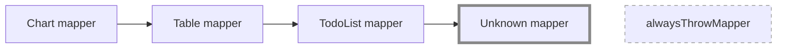
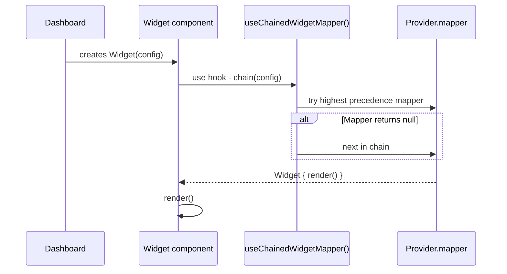

# 🚀 Dynamic Dashboard with Advanced State Management

This project showcases a dynamic dashboard application built with React.
It is part of a private assignment for learning purposes.

## Running the Project

To run this project locally, follow these steps:

1. Clone the repository
2. Install dependencies using `npm install`
3. Build production version using `npm run build`
4. Start preview production server using `npm run preview`

If you want to run the development server, rather than production build, use `npm run dev`.

On first application boot, the dashboard will be empty. Use the "Add Widget" button to add new widgets to the dashboard.

There are a couple of Dashboard examples available in the `public/dashboards` folder.
You can load them using the `Import from JSON` feature.

## Features

- Add, remove, and rearrange widgets on the dashboard
- Import and export dashboard configurations via JSON
- Dashboard locking to prevent accidental changes
- Fluid, stretchable container layout
- Fully responsive design for every screen size
- Dark and light mode

## Technologies Used

- [React](https://github.com/facebook/react) (with React Compiler)
- [Zustand](https://github.com/pmndrs/zustand) for advanced state management
- [Mantine](https://github.com/mantinedev/mantine) UI component library
- [DnD Kit](https://github.com/clauderic/dnd-kit) for drag-and-drop functionality
- [Vitest](https://github.com/vitest-dev/vitest) + [React Testing Library](https://github.com/testing-library/react-testing-library) for testing
- [Eslint](https://github.com/eslint/eslint) + [Prettier](https://github.com/prettier/prettier) for code quality and formatting

## Widget Architecture

Proposed and implemented architecture allows:

- dynamic widget type registration
- mapping (render resolution),
- dynamic form composition,

all in a type-safe manner, because of TypeScript.

### Core Runtime Types

- WidgetConfig: { id, type, title, description? }
- Widget: WidgetConfig + render(): ReactNode
- WidgetDynamicTypeProvider: { mapper, metadata, createNew, form }
- metadata: { type, label, description, icon?, hidden? }
- form.fields: dynamic schema (primitive | array) with validation.
- Unknown provider always present; guarantees safe fallback.

### Provider Registration & Precedence

Providers are appended as nested `WidgetDynamicTypeContextProvider` wrappers.
This opens up a **plugin-based** architecture, allowing new widget types
to be added without modifying existing, core code.

### Chained Mapper Resolution

In current implementation, `useChainedWidgetMapper` builds a single function, composed of the following providers' mappers:

Note that in this implementation, the `unknown` provider's mapper is terminal.
It **always** returns a renderable `Widget`, preventing runtime errors.

> [!TIP]
> This architecture allows for flexible extension - new providers can just be added to the chain.

### Rendering Pipeline

A widget's UI is produced only when its mapper returns a concrete `Widget` with a `render` function.
`Widget` component invokes chained `mapper` & `render` functions inside `Suspense` + `ErrorBoundary`.
Widget corpus is always rendered, content is dynamic and in safe context, because of `ErrorBoundary`.

### Extending

To add a new widget type, simply:

1. Implement all needed interfaces with concrete implementation.
2. Register your provider with all runtime dependencies into the app tree (via context Api).
